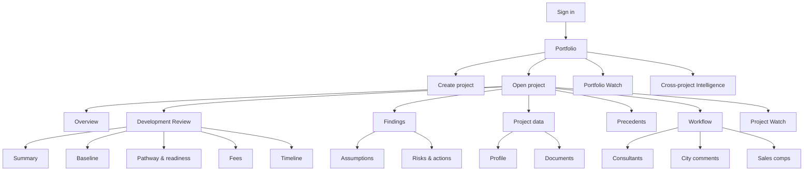
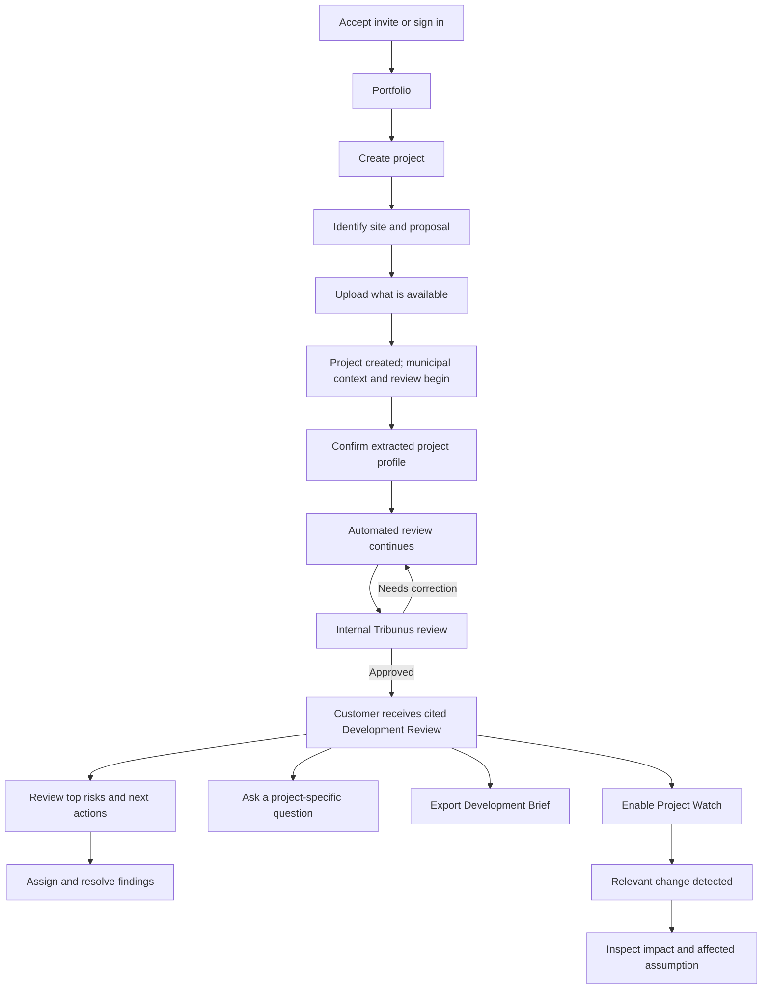
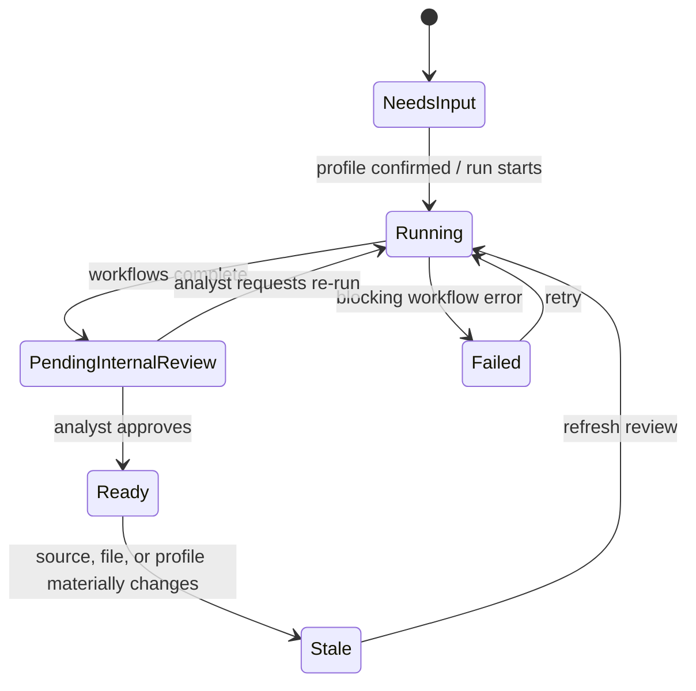

# Tribunus — UX Flows & Interface Blueprint

**Role of this document:** Product management, UX design, and UI direction only

**Status:** Proposed experience blueprint · August 2026

**Scope:** All 19 locked MVP features, 6 visible placeholders, internal operations, and reserved placement for deferred features

**Non-goal:** This document does not add, remove, or redefine product features.

---

## 1. Product experience in one sentence

Tribunus is a calm, project-first operating system where a development manager can see what is proposed, what the rules allow, what could go wrong, what changed, and what to do next—with every material claim traceable to evidence.

It must feel like a trusted control room, not a chatbot, a feed, or a collection of AI demos.

### The UX hierarchy

Every screen should reinforce this order:

1. **What needs attention?** Risks, changed rules, unsupported assumptions, and overdue actions.
2. **What should I do next?** No more than five prioritized actions.
3. **Why is Tribunus saying this?** Evidence, calculation, comparison, and confidence.
4. **What else can I inspect?** Full baseline, fees, pathway, precedents, documents, and history.

The interface should never give equal visual weight to every available feature. The Development Review is the main product action; everything else either supplies it, explains it, or turns its findings into follow-through.

---

## 2. Source-of-truth decisions used in this blueprint

This UX uses the [locked feature list](locked_feature_list.md) as the scope authority. The [focus memo](clarifications.md) supplies product emphasis—large developers, entitlement and approval-risk intelligence, portfolio monitoring, and cited outputs—but its still-open cut decisions are not treated as approved feature changes. The [domain guide](domain_knowledge.md), [AI architecture](ai_architecture.md), interview notes, and [tech stack](tech_stack.md) inform terminology, trust states, and visual language.

Where the repository contains competing directions, this document resolves the **presentation**, not the scope:

- All locked features retain a home.
- Infrastructure features appear through their user-facing effect instead of becoming customer navigation.
- Placeholder features look intentional but are visually quiet and never masquerade as working functionality.
- Deferred capabilities have reserved future placement so they can be added without restructuring the product.
- The product remains desktop-first; no mobile application is introduced.

---

## 3. Users and their operating modes

### Primary user: Development / Project Manager

Owns the municipal file day to day. Needs to validate assumptions, coordinate follow-up, prepare meetings, and keep principals informed. This is the default view and density level.

### Economic buyer: Principal / VP Development

Visits less often. Needs a portfolio scan, the five things that could change a decision, financial exposure, freshness, and a defensible brief for an investment committee. The Overview and exported brief must work without training.

### Supporting user: Analyst / Planner / Consultant

Needs the source-level detail, formulas, documents, precedents, and assigned actions behind a conclusion. Their path starts from a finding or task, not from a generic dashboard.

### Internal user: Tribunus Analyst

Validates AI-assisted work before release. Needs a separate review queue, fast source comparison, edit/suppress controls, and an explicit publish gate. Internal controls must never leak into the customer experience.

### Access behavior

| Role | Default landing view | Can change project data | Can run review | Can assign/resolve | Can manage team |
| --- | --- | ---: | ---: | ---: | ---: |
| Admin | Portfolio | Yes | Yes | Yes | Yes |
| Member | Last project or Portfolio | Yes, if project access allows | Yes | Yes | No |
| Viewer | Portfolio | No | No | No; may comment if allowed | No |
| Tribunus analyst | Internal review queue | Internal corrections only | Re-run workflows | Internal only | No customer access management |

Do not show disabled controls that a role will never be able to use. Show disabled controls only when the user can understand and resolve the temporary condition.

---

## 4. Experience principles

### 4.1 Project first, AI second

The address, proposal, rules, and outstanding decisions are the interface. AI is an implementation detail. Do not use sparkle icons, “AI-powered” labels, prompt suggestions on every page, or conversational UI where a table or form is clearer.

### 4.2 One dominant action per context

- Portfolio: **Create project**
- New project: **Create and start review**
- Project with no approved review: **Run Development Review**
- Project with material changes: **Refresh Development Review**
- Analyst review: **Approve for customer**

All other actions are secondary, tertiary, or in a `•••` menu. Never place several coral buttons in the same viewport.

### 4.3 Summary first, evidence one step away

The user should understand a finding without opening a source. The source must still be available in one click, in context, without navigating away. Use a right-side evidence drawer for this.

### 4.4 Unknown is a legitimate state

Never force false completeness. “Requires confirmation,” “Not provided,” and “Not yet reviewed” are first-class states with a clear resolution action. Empty is not zero; unknown is not low risk.

### 4.5 Freshness is always visible where it matters

Rules, fees, findings, and reports show `Verified [date]`. Use “Updated today” only for recent activity; show an absolute date on hover and in exports. Stale information receives an amber label and a next action, not a vague warning.

### 4.6 Status is never communicated by color alone

Every state combines text, icon, and color. A high-risk item says **High risk**; it is not merely red. Confidence and severity are separate concepts and must never share the same badge.

### 4.7 Stable placement beats novelty

Project navigation, filter locations, table columns, and action placement should not jump between pages. A non-technical expert should build muscle memory after one session.

### 4.8 Progressive disclosure controls density

Start with the decision. Expand to reasoning. Open the source only when requested. Do not show formulas, citation metadata, long AI prose, and source excerpts at the same time in the default view.

---

## 5. Information architecture

### Global navigation

The left rail contains only destinations that work across projects:

1. **Portfolio** — all projects and cross-project intelligence
2. **Watch** — project-relevant alerts and digests across the firm
3. **Intelligence** — cross-project precedent/council search; shown when the corpus is useful independently
4. **Recent projects** — up to five, pin-capable; not a complete nested project tree
5. **Internal review** — Tribunus staff only
6. **Settings** — workspace, team, permissions, notifications

The project’s own sections appear in a stable secondary rail after a project is opened:

1. Overview
2. Review
3. Findings
4. Project data
5. Precedents
6. Workflow
7. Watch

“Ask this project” is a secondary header action that opens a drawer. Export is also a header action. Neither occupies the navigation rail.



### Why features are grouped this way

Users do not think in feature IDs. They think in questions:

- **Overview:** “What needs my attention?”
- **Review:** “What did Tribunus conclude, and why?”
- **Findings:** “What assumptions and risks must we control?”
- **Project data:** “What information did the review use?”
- **Precedents:** “What happened on comparable projects?”
- **Workflow:** “Who owes what, and does the deal still make sense?”
- **Watch:** “What changed after the review?”

---

## 6. Global application shell

### Desktop layout

```text
┌──────────────────────────────────────────────────────────────────────────────┐
│  TRIBUNUS  Workspace ▾      Search / Command K       Help   Activity   User │ 56
├───────────────┬──────────────────────────────────────────────────────────────┤
│ Portfolio     │ Breadcrumb / project identity                               │
│ Watch         │──────────────────────────────────────────────────────────────│
│ Intelligence  │ Page title + concise state            Secondary   PRIMARY  │
│───────────────│──────────────────────────────────────────────────────────────│
│ Recent        │                                                              │
│ • Marigold    │                    Page content                              │
│ • Robinson    │                                                              │
│ + All projects│                                                              │
│               │                                                              │
│───────────────│                                                              │
│ Settings      │                                                              │
└───────────────┴──────────────────────────────────────────────────────────────┘
     232 px                   flexible; 32 px outer gutters
```

### Placement rules

- Left rail: 232 px expanded, 72 px collapsed, sticky for the viewport.
- Top bar: 56 px, with global search in the center and utility controls on the right.
- Page header: title and status on the left; at most one primary action on the far right.
- Content: 32 px desktop gutters; readable prose capped near 760 px; tables and maps may use the full content width.
- Drawers: 440–520 px on desktop. Evidence, finding detail, and Ask use the same right-drawer behavior.
- Never nest a drawer inside a modal. If a source is opened from a modal, replace the modal with the source drawer and retain a back affordance.

### Global search and command menu

`⌘/Ctrl K` searches projects, addresses, findings, documents, people, and precedents. Results group by type and show jurisdiction/project context. Commands appear below search results only when relevant: “Create project,” “Upload document to Marigold,” or “Open unresolved high risks.” Do not mix web-wide chat answers into search.

---

## 7. Primary end-to-end journey



### Time-to-value behavior

Creation should feel fast even though analysis is not. Immediately after the project record is created:

- Land on the project Overview.
- Show the project identity and the information already known.
- Start municipal context and document extraction in the background.
- Present a compact progress panel with named stages, not a spinner with a fake percentage.
- If profile confirmation is required, make **Review extracted profile** the one primary action.
- Continue unaffected work while the review runs; notify the user in-app and by email when the customer-ready review is approved.

---

## 8. Authentication, workspace, and account flows — F1

### Sign-in page

Use a narrow, centered panel on the cream canvas. Show the Tribunus wordmark, one sentence of value, email field, **Continue with email**, and a subtle security/privacy note. Magic-link success replaces the form with “Check your email” and a resend timer.

Do not add testimonials, animated backgrounds, AI imagery, or a second promotional column to the product sign-in experience.

### Invitation flow

```text
Invite link → Confirm name → See firm and role → Accept → Portfolio
```

The user should see which firm invited them, who invited them, and what role they will receive before acceptance. Expired links provide **Request a new invite**, not a dead end.

### Settings layout

Settings uses a simple local rail:

- Workspace
- Team and invitations
- Roles and project access
- Notifications
- Security and sessions

Team is a table with name, email, role, project access, last active, and overflow actions. **Invite member** sits in the page header. Removing access requires a confirmation that names affected projects; changing a role does not require a modal.

Activity history is accessed from workspace/project `•••` menus and shown as a filterable chronological table, not as a noisy feed on the main dashboard.

---

## 9. Portfolio Home — F2

### Page objective

Answer within ten seconds: Which project needs attention, what changed across the portfolio, and where should I go next?

### Recommended layout

```text
┌─────────────────────────────────────────────────────────────────────────────┐
│ Portfolio                                  Updated Aug 10   + Create project│
│ 12 active projects · 4 need attention                                  │
├─────────────────────────────────────────────────────────────────────────────┤
│ [Needs attention 4] [Watch changes 3] [Reviews pending 2] [All projects 12]│
├───────────────────────────────────────┬─────────────────────────────────────┤
│ PROJECTS                              │ PORTFOLIO EXPOSURE                  │
│ Search...  Stage ▾ Municipality ▾     │ • 5 projects use a superseded fee  │
│                                       │ • 3 exposed to policy amendment    │
│ Marigold & Litchfield       High  3   │ • 42% concentrated in Coquitlam    │
│ Coquitlam · Townhouse · Feasibility   │                                     │
│ Review ready · Verified Aug 8         │ View portfolio intelligence →       │
│───────────────────────────────────────│─────────────────────────────────────│
│ Robinson & Spring           Med   2   │ UPCOMING                            │
│ Coquitlam · Multifamily · Pre-app     │ Aug 14  Two finding deadlines       │
│ Needs profile confirmation            │ Aug 18  Weekly digest                │
│───────────────────────────────────────│ Aug 30  Fee rate effective date      │
│ ...                                   │                                     │
└───────────────────────────────────────┴─────────────────────────────────────┘
```

### Behavior and hierarchy

- Use a **list/table hybrid**, not oversized cards. Large firms need scanning and sorting.
- Default sort is “Needs attention,” then most recent meaningful change—not recently created.
- Each row shows project name, address/municipality, type/stage, review state, open-risk count, last verified date, and Watch state.
- The entire row opens the project. Inline controls are limited to star/pin and overflow.
- Summary tiles are filters, not vanity metrics. Selecting “Watch changes 3” filters the list.
- Portfolio exposure occupies a secondary column at wide widths and moves below the list on smaller screens.
- Municipality concentration, common policy exposure, shared fee changes, nearby competition, and consultant dependencies appear only when actionable. Avoid charts with one data point or invented scores.

### Empty state

Use a short explanation and one action:

> **No projects yet**
>
> Add a site and whatever information you have. Tribunus will begin building a cited baseline immediately.
>
> **Create your first project**

No sample projects should appear unless clearly labeled as a guided demo and deliberately enabled for the workspace.

---

## 10. Create Project — F3

### Form strategy

Use a focused four-step route rather than a long modal. Persist every field as entered. Mark only project name, address/parcel, and municipality as required for creation; make incompleteness explicit but non-blocking.

```text
┌──────────────────────────────────────────────────────────────────────┐
│ Create project                                         Save and exit │
│ Site ━━━━━ Proposal ───── Documents ───── Review                     │
├──────────────────────────────────────────────────────────────────────┤
│ Where is the site?                                                   │
│                                                                      │
│ Project name *                                                       │
│ [ Marigold & Litchfield                                      ]       │
│ Address or parcel *                                                  │
│ [ 1234 Example Street, Coquitlam                             ]       │
│ [Suggested address + parcel preview]                                 │
│ Municipality *            [Coquitlam ▾]                              │
│                                                                      │
│                                   Cancel        Continue →            │
└──────────────────────────────────────────────────────────────────────┘
```

### Steps

1. **Site** — name, address/parcel, municipality; map/parcel preview only if reliably available.
2. **Proposal** — development type, stage, tenure, approximate units, height/storeys, FSR, description. Each optional field says “You can add this later.”
3. **Documents** — drag/drop area, file picker, categories; fully skippable.
4. **Review** — concise summary, missing-information notice, privacy reminder, **Create and start review**.

### Address behavior

- Suggestions show street address, municipality, and parcel identifier when known.
- If multiple parcels are detected, ask the user to confirm or select; never silently choose.
- A drawn parcel is an alternative input mode, not a second required task.
- Auto-retrieved context shows after project creation so slow GIS/data calls do not block the form.

### Validation

Inline errors appear under the field when focus leaves it. The Continue button can be pressed; then focus moves to the first invalid field and an error summary appears at the top. Do not disable Continue with no explanation.

---

## 11. Project shell and Overview

### Persistent project header

```text
Marigold & Litchfield                       [Ask project] [Export] [Run review]
1234 Example St, Coquitlam · Townhouse · Feasibility
Review ready · Verified Aug 8, 2026 · Watch on
```

The title/address anchor the user. The status line always exposes review state and freshness. When the primary action changes—from Run, to Review profile, to View review, to Refresh—the button remains in the same location.

### Project navigation

On wide screens, use a secondary left rail. On medium screens, use a horizontally scrollable tab row below the project header. Preserve order in both.

### Overview wireframe

```text
┌───────────────────────────────────────┬───────────────────────────────────┐
│ DECISION SNAPSHOT                     │ NEXT ACTIONS                      │
│ 3 high risks · 2 unsupported          │ 1 Confirm applicable ACC regime  │
│ assumptions · 1 fee change upcoming   │ 2 Resolve unit-count conflict     │
│                                       │ 3 Commission servicing review     │
│ Likely pathway: Rezoning → DP → BP    │                  View all actions │
├───────────────────────────────────────┼───────────────────────────────────┤
│ TOP RISKS                             │ REVIEW STATUS                     │
│ High  Setback departure unsupported   │ Customer-ready · Aug 8            │
│ High  DCC rate changes before BP      │ 48 sources · 6 need confirmation  │
│ Med   OCP interpretation uncertain    │ View Development Review →         │
├───────────────────────────────────────┴───────────────────────────────────┤
│ RECENT PROJECT ACTIVITY                                                   │
│ Aug 10  Fee schedule changed · 2 assumptions affected                     │
│ Aug 8   Development Review approved                                      │
│ Aug 7   stats-sheet-v3.xlsx uploaded                                     │
└───────────────────────────────────────────────────────────────────────────┘
```

The Overview contains no duplicate full tables. Each module previews a destination and links to it. Do not put chat, upload, recent sources, tips, news, and every KPI on this page.

---

## 12. Project data: Documents and Structured Profile — F4, F5

### Local tabs

`Profile` · `Documents`

Profile comes first after initial extraction. Documents becomes the default after the profile is confirmed.

### Structured Project Profile

Group fields by how a developer reads a proposal:

- Site and existing condition
- Proposed program
- Density and floor area
- Building envelope
- Access, parking, and loading
- Tenure and stage
- Requested departures/variances

Use a two-column definition layout in view mode and the same spatial grouping in edit mode. Each extracted value shows its source count and state. Conflicts appear directly beneath the affected field.

```text
PROPOSED PROGRAM
Units              218                    Confirmed ✓
                   Conflict: rationale says 210
                   [Compare 2 sources] [Use 210] [Keep 218]

Target FSR         3.20                   From stats-sheet-v3.xlsx · p.2
Height             Not provided           [Add height]
```

Use one **Confirm profile** action after bulk review. Individual changes save as draft until confirmation. If a confirmed value changes later, state which review outputs may be stale and offer **Save and refresh review**.

### Documents page

```text
┌───────────────────────────────────────────────────────────────────────────┐
│ Documents (24)                                      [Upload documents]    │
│ Search documents...       Category ▾ Status ▾ Version ▾                  │
├───────────────────────────────────────────────────────────────────────────┤
│ Name                    Category       Version  Uploaded     Status        │
│ Stats sheet             Project stats v3       Aug 7        Current       │
│ Planning rationale      Rationale     v2       Aug 4        Current       │
│ Concept drawings        Drawings      v5       Aug 1        Current       │
│ Concept drawings        Drawings      v4       Jul 18       Superseded    │
└───────────────────────────────────────────────────────────────────────────┘
```

- Default view shows current versions; a filter reveals superseded files.
- Upload opens a large drop zone with a queue. Category can be applied per file or in bulk.
- Version replacement is explicit: **Upload new version**, then select the file being superseded.
- Clicking a row opens document preview with metadata, related findings, and version history in a side panel.
- Delete is in overflow, requires confirmation, and states whether analysis outputs reference the file.
- Processing states are specific: Uploaded → Extracting → Ready → Needs attention. A failed extraction does not imply the original file is lost.

---

## 13. Development Review — F6, F7, F8, F10, F14

### Review state model



Customer-facing language:

| System state | Customer label | Primary action |
| --- | --- | --- |
| Needs input | Profile needs confirmation | Review profile |
| Running | Development Review in progress | View progress |
| Pending internal review | Analysis under Tribunus review | None; “We’ll notify you” |
| Ready | Review ready | View review |
| Stale | Review may be out of date | Refresh review |
| Failed | Review needs attention | Retry or contact support |

### Review navigation

Within Review, use a sticky local table of contents:

`Summary` · `Baseline` · `Pathway & readiness` · `Fees` · `Timeline`

Precedents have a dedicated project section because they support exploration beyond one review, but the Summary previews the closest three.

### Review Summary wireframe

```text
┌────────────────────────────────────────────────────────────────────────────┐
│ Development Review                                                        │
│ Customer-ready · Verified Aug 8 · 48 sources · 6 require confirmation     │
│                                             [Download brief] [•••]         │
├────────────────────────────────────────────────────────────────────────────┤
│ REVIEW IN ONE MINUTE                                                       │
│ Likely pathway  Rezoning → DP → BP      Estimated fees  $4.2M–$5.0M       │
│ Timeline range  18–26 months            Readiness       72% items complete │
│                                                                            │
│ Assessment: Policy support is plausible, but fee timing and the requested │
│ setback departure create material exposure. [Why this assessment?]        │
├───────────────────────────────────┬────────────────────────────────────────┤
│ TOP RISKS                         │ TOP OPPORTUNITIES                      │
│ High  Setback unsupported         │ Policy-aligned tenure incentives      │
│ High  2027 regional DCC exposure  │ Similar departure approved nearby     │
│ Med   Servicing capacity unknown  │ No public hearing may be required     │
├───────────────────────────────────┴────────────────────────────────────────┤
│ NEXT FIVE ACTIONS                                                           │
│ □ Confirm ACC treatment with municipality       Owner   Due date           │
│ □ Resolve conflicting unit count                Owner   Due date           │
│ ...                                                                        │
├────────────────────────────────────────────────────────────────────────────┤
│ MISSING INFORMATION · CLOSEST PRECEDENTS · MATERIAL FEES                   │
└────────────────────────────────────────────────────────────────────────────┘
```

Do not display an approval-probability score, giant circular risk score, or generated essay. If a readiness percentage is shown, it must be a deterministic ratio of completed checklist items and be labeled as such.

### Verified Site Baseline — F6

Use a comparison-led table where applicable:

| Topic | Proposed | Current rule / condition | Assessment | Evidence |
| --- | --- | --- | --- | --- |
| Use | Multifamily | Permitted subject to… | Verified fact | 2 sources |
| FSR | 3.20 | Base 2.50; up to 3.50 if… | Requires confirmation | 3 sources |
| Height | 6 storeys | 6 storeys / 21 m | Verified fact | 1 source |
| Rear setback | 2.5 m | 3.0 m | Departure identified | 2 sources |

Group rows into Zoning, Plan and overlays, Development Permit Areas, Site constraints, Transit/context, and Submission requirements. A compact map may accompany the table only when it clarifies parcel/overlay relationships; it must not dominate the page.

Every baseline row includes:

- status type: Verified fact / Calculated result / Tribunus assessment / Requires confirmation;
- source authority and effective date;
- last checked date;
- contradiction indicator when sources disagree;
- action to resolve uncertainty.

### Approval Pathway and Application Readiness — F10

Display the pathway as a horizontal stage sequence on wide screens and a vertical stepper on narrow screens:

```text
[Pre-application] → [Rezoning] → [Development Permit] → [Building Permit]
     Complete         Likely           Dependent              Later
```

Selecting a stage opens its details below: decision-maker, required documents, consultants/studies, dependencies, likely review cycles, and unknowns. Use a checklist for readiness, grouped by stage; do not create a second task system. “Convert to finding” creates or links a record in Findings when ownership and resolution tracking are needed.

### Fees & Contributions Review — F7 + F8

The page has three layers:

1. **Summary:** current estimated range, amount deterministically calculated, amount uncertain, and next known effective change.
2. **Fee table:** charge, authority, trigger date/stage, rate basis, amount/range, status, effective date.
3. **Calculation detail:** opened per row in a drawer.

```text
Regional DCC                                           [calculated total]
Calculated result · [effective date range] · Due at BP
[confirmed units] × [current sourced rate] = [total]   View official schedule →
Inputs: Units [from confirmed profile]                 No hidden assumptions
```

The example above illustrates placement only; production values must come from the deterministic calculator and source schedule. Never let generated prose perform or obscure the arithmetic.

Status labels remain distinct:

- Deterministically calculable
- Preliminary estimate
- Negotiated / uncertain
- Requires municipal confirmation

The optional economic bridge, if approved in product scope, belongs beside a fee as “Impact per buildable sq. ft.” It must not become a separate pro forma dashboard.

### Timeline Forecasting — within F10

Use a range bar per stage with the comparable sample count and confidence caveat. Avoid implying precision with exact completion dates unless inputs are deterministic. Highlight delay drivers beside the affected stage and link each to a finding or precedent.

---

## 14. Evidence and Citation interaction — F14

Evidence is a system-wide interaction, not a separate navigation destination.

### Evidence trigger

Use a consistent text control such as `2 sources` or `Source · p. 14`. Place it directly beside the claim, table row, or calculated value. Do not hide citations in footnotes or place all sources at the bottom of a long page.

### Evidence drawer

```text
                                      ┌───────────────────────────────────┐
Main page remains visible             │ Evidence                     [×] │
                                      │ Rear setback requirement          │
                                      │ Verified fact · High confidence   │
                                      │───────────────────────────────────│
                                      │ Coquitlam Zoning Bylaw            │
                                      │ § 1204.3 · p. 214                  │
                                      │ Effective Jul 7, 2025              │
                                      │ Last checked Aug 8, 2026           │
                                      │                                   │
                                      │ Highlighted source excerpt         │
                                      │ in surrounding page context…       │
                                      │                                   │
                                      │ [Open full document] [Download]    │
                                      │───────────────────────────────────│
                                      │ Contradictory / older sources (1)  │
                                      └───────────────────────────────────┘
```

### Trust labels

Use these exact customer-facing concepts consistently:

- **Verified fact** — directly supported by an authoritative source.
- **Calculated result** — deterministic formula with visible inputs.
- **Tribunus assessment** — reasoned interpretation; evidence supports it but does not state it verbatim.
- **Requires confirmation** — evidence is missing, ambiguous, contradictory, or authority-specific.

Confidence describes evidence quality; it does not replace these types. Source authority, publication date, effective date, and last checked date must remain distinguishable.

---

## 15. Findings Register — F11

Assumptions and risks share one feature but retain distinct views.

### Default page

```text
┌────────────────────────────────────────────────────────────────────────────┐
│ Findings                                               [+ Add finding]     │
│ [All 18] [Assumptions 9] [Risks 9]     Search...  Filters ▾  Group by ▾  │
├────────────────────────────────────────────────────────────────────────────┤
│ Type       Finding                 Severity Confidence Owner Due    Status │
│ Assumption Applicable ACC regime   High     Medium     Maya  Aug 14 Open   │
│ Risk       Setback departure       High     High       Liam  Aug 16 Review │
│ Assumption Proposed units = 218    Medium   High       Maya  —      Verified│
└────────────────────────────────────────────────────────────────────────────┘
```

Default sorting is open high-severity items, then due date. Filters are encoded in the URL and survive return navigation. Allow saved views only after users demonstrate repeated filter needs; do not add configuration prematurely.

### Finding detail drawer

Sections appear in this order:

1. Title, type, status, severity, confidence
2. Why it matters / potential impact
3. Current value and supporting evidence
4. Recommended action
5. Owner and due date
6. Linked assumptions/risks, documents, review section
7. Resolution notes and history

Changing status to Resolved requires a resolution note or evidence. When an unverified assumption becomes a risk, show a visible relationship rather than duplicating text. Activity is chronological at the bottom, collapsed by default.

### Inline actions

- Single click: open detail.
- Checkbox: select for bulk owner/status changes; never use it as “resolved.”
- Owner and due date may be changed inline.
- Severity/confidence changes open the detail drawer because they require context.

---

## 16. Precedent & Council Intelligence — F12

### Project entry point

Default to ranked comparable projects based on the current project. Search and filters are secondary, not an empty query box.

```text
┌───────────────────────────────┬────────────────────────────────────────────┐
│ Comparable projects           │ Selected precedent                         │
│ Search / filters              │ 5678 Sample Ave · Coquitlam               │
│                               │ 86% comparable — why / why not            │
│ 1  5678 Sample Ave       86%  │                                            │
│    Approved with conditions   │ Original → Revisions → Staff → Council     │
│    0.7 km · 3.1 FSR           │ 2023       2024        Rec.      Approved  │
│                               │                                            │
│ 2  22 Example Rd         79%  │ Key concessions                            │
│    Revised                    │ • Height reduced one storey                │
│                               │ • Added rental tenure covenant             │
│ 3  ...                        │ Council concerns · Conditions · Sources    │
└───────────────────────────────┴────────────────────────────────────────────┘
```

### Comparison behavior

- “86% comparable” may be used only if it is a transparent deterministic match score. Otherwise say **Strong match** and show matched dimensions.
- Always show **Why comparable** and **Important differences** together.
- Support selecting up to three records for a structured side-by-side comparison; do not compare long narrative cards.
- Comparison dimensions: municipality, neighbourhood/radius, use/type, site size, tenure, units, height/FSR, requested departures, pathway, policy context, outcome, conditions, and timeline.

### Decision trace

Use a chronological event rail: original proposal → staff concern → public feedback → revision → staff recommendation → council debate/vote → conditions/outcome. Each event opens its source. Gray-area departures are visually tagged but never described as permission for the current project.

### Council and staff view

From global Intelligence, users can switch from `Projects` to `Meetings & council`. Meeting summaries start with agenda item and decision, then show debated themes versus the written recommendation. Member profiles show sourced voting history and themes without personality scoring or unsupported predictions.

Prominently state corpus coverage and the date through which meetings were reviewed. A limitation label is mandatory for parsed meeting material.

---

## 17. Project Watch and alerts — F13

### Opt-in

Project Watch is enabled from the project header or Watch page. The setup sheet shows monitored categories, delivery cadence, recipients, and a preview of what qualifies as relevant. Default to one weekly digest plus urgent material alerts; users may adjust categories without navigating to global settings.

### Watch page

```text
┌────────────────────────────────────────────────────────────────────────────┐
│ Watch · Marigold & Litchfield                            [Watch settings]  │
│ Monitoring 42 sources · Last checked today at 06:10                       │
├────────────────────────────────────────────────────────────────────────────┤
│ New  Fee schedule changed                                      Material   │
│      Effective Jan 1, 2027 · Detected Aug 10                              │
│      Affects: “Regional DCC remains at 2026 rate”                         │
│      Potential impact: +$1.08M at current unit count                      │
│      Recommended: update underwriting and confirm BP timing               │
│      [Review impact] [View source]                                        │
├────────────────────────────────────────────────────────────────────────────┤
│ Aug 7  Council approved a nearby comparable with conditions               │
│ Aug 2  No material changes in weekly digest                               │
└────────────────────────────────────────────────────────────────────────────┘
```

Each alert must answer: what changed, which project/assumption is affected, why it matters, potential impact, recommended action, and source. **Review impact** opens a comparison of old versus new and offers to create/update a finding. “Mark read” is not the primary outcome.

### Portfolio Watch

Group identical changes once and list affected projects beneath them. Do not send one duplicate alert per project. Filters include Materiality, Jurisdiction, Change type, Project, and Read/unread. Avoid a social-media notification badge count; show only the number of unread material items.

---

## 18. Reports & Export — F16

**Export** remains in the project header. It opens a configuration sheet, not a separate design tool.

### Export flow

```text
Export → Choose audience/preset → Review included sections → Generate → Download/share
```

Presets:

- Executive / investment committee
- Full Development Brief
- Findings and actions
- Sources appendix

The user can include/exclude sections and choose PDF or Word. The preview shows page count, data freshness, unresolved confirmation items, and whether the review is customer-ready. Draft/unapproved exports have a visible **Draft — analysis under review** watermark and cannot be mistaken for the final brief.

The report starts with decision summary, material risks, and next actions—not a product cover page. Sources and limitations stay attached to the claims they support, with a full appendix at the end.

---

## 19. Workflow section — F17, F18, F19

These capabilities keep their defined scope but are grouped in one project section so they do not dilute the entitlement-risk wedge.

### Consultant requirements and dependencies — F17

Local tab: `Consultants`

Use a discipline-by-stage matrix with rows for civil, mechanical, electrical, sanitary, storm, water, landscape, geotechnical, and utilities. Columns: requirement, owner/firm, required by stage, dependency, due date, latest deliverable, and state.

Default view is **Needs attention**, not every completed deliverable. A dependency map is available as a secondary view when three or more linked requirements exist. Assignment uses the same person picker and status vocabulary as Findings, but consultant deliverables remain separate domain objects.

### City comment management — F18

Local tab: `City comments`

```text
Upload comment letter → Extract comments → Review extraction → Assign → Link response/revision → Verify resolved
```

The page uses a split view: comment list on the left, selected comment and response history on the right. Preserve letter section and page reference. Extraction must be confirmed before comments become assignments. Statuses: New, Assigned, Response drafted, Submitted, Confirmed resolved. “Submitted” is not “Resolved.”

### Local sales comps and feasibility check — F19

Local tab: `Sales & feasibility`

Start with a concise tenure-aware check: land/product comp range, $/sq. ft., sale dates, cost/unit benchmark, and the current project’s position. Map is secondary to the comparison table. Clearly label data period and source. Do not build a second underwriting UI; provide exportable values and, if approved, a thin cost-per-buildable-square-foot bridge.

---

## 20. Ask This Project — P1 placeholder

### Placement

Use a project-header button that opens a right drawer. Do not use a floating orb, permanent chat column, or chatbot as the home screen.

### Drawer structure

```text
Ask Marigold & Litchfield
[ What should we ask the City about the setback?              ] [Send]

Suggested only when empty:
• Explain the highest-risk assumption
• Show the strongest comparable
• Summarize unresolved issues

Answer in concise paragraphs or bullets
[1] source chip  [2] source chip
Interpretation · Review verified Aug 8

Follow-up input…
```

Answers cite project/municipal sources inline, distinguish assessment from fact, and can link to existing findings. Provide **Create finding from answer** only in the answer overflow menu, not after every response.

Because this is a placeholder, a user who invokes it should receive honest availability language or a controlled waitlist/demo state. Do not simulate a submitted question or fabricate an answer. The entry point can be labeled `Preview` until the backend is enabled.

---

## 21. Remaining placeholders — P2–P6

Placeholder pages should demonstrate intended placement and information architecture without presenting dead controls throughout the core product.

| Placeholder | Reserved location | Intended page pattern | UX guardrail |
| --- | --- | --- | --- |
| P2 Scenario Comparison | Project Review → `Compare scenarios` secondary action | Three-column comparison: conservative / policy-aligned / aggressive; shared row labels | Never reduce to one approval score; show changed inputs and evidence |
| P3 Entity Matching & Linking | Internal data operations; entity links visible in sources/predecessor records | Relationship inspector: address ↔ parcel ↔ application ↔ meeting ↔ decision | Customer sees uncertainty when a match is unconfirmed, not internal graph tooling |
| P4 Analysis Engine & Run History | Review `•••` → Run history; internal workflow details in analyst console | Chronological runs with inputs/source/file/workflow versions and outcome | No customer-facing chain-of-thought or raw internal prompts |
| P5 Growth Forecasting | Global Intelligence → Growth | Map + policy/transit timeline + sourced signals | Label projection vs. approved plan; no speculative heatmap without evidence |
| P6 Competitor Extras Analysis | Workflow → Sales & feasibility → Product extras | Comparable product table by project and sale period | Keep separate from critical entitlement risks; no generic market-content feed |

When disabled, show a single composed preview with what it will do and availability status. Do not scatter “Coming soon” cards across Overview or navigation. A workspace-level feature flag should either expose the page coherently or hide it.

---

## 22. Internal Analyst Review Console — F15, with F9/P3/P4 support

Internal operations use a visually related but clearly labeled environment. The global header says **Tribunus Operations** and never resembles a customer workspace.

### Queue

```text
┌────────────────────────────────────────────────────────────────────────────┐
│ Review queue                         Unassigned 8  Mine 4  Blocked 2       │
│ Project             Municipality  Stage      Age     Flags      Assignee  │
│ Marigold            Coquitlam     Verify     2h      3 conflicts Maya      │
│ Robinson            Coquitlam     Sources    6h      1 stale     —         │
└────────────────────────────────────────────────────────────────────────────┘
```

Sort by customer impact/SLA, then age. “Flags” includes unsupported findings, contradictory sources, stale source versions, extraction conflicts, and failed calculations.

### Review workspace

Use a three-pane desktop layout:

```text
┌──────────────────┬──────────────────────────────────┬──────────────────────┐
│ Review outline   │ Candidate output                 │ Evidence / source    │
│ Profile facts    │ Finding title, explanation,      │ Page preview with    │
│ Baseline         │ confidence, severity, action     │ cited text highlighted│
│ Fees             │                                  │ metadata + versions  │
│ Assumptions      │ [Edit] [Suppress] [Needs source] │                      │
│ Risks            │                                  │                      │
│ Precedents       │ Previous / Next                  │                      │
└──────────────────┴──────────────────────────────────┴──────────────────────┘
```

The footer holds progress and the one gate action: **Approve for customer**. Require all blocking flags to be resolved or explicitly waived with a note. Re-running an individual workflow preserves analyst edits and clearly previews what will be replaced.

### Municipal ingestion and source operations — F9

This is an internal page under Operations, not customer navigation. Use a source table by jurisdiction and type with current/superseded state, effective date, last checked, ingestion status, and affected projects. Adding or replacing a source requires jurisdiction, authority, dates, and version relationship before it can become “current.”

Calculators (F8), evidence verification (F14), entity matching (P3), and automated quality gates/run history (P4) surface as contextual validation states inside this workspace rather than four separate admin dashboards.

---

## 23. Deferred features: future-safe placement only

These items remain deferred. Their placement is reserved to avoid future navigation sprawl; no active controls are required now.

| Deferred capability | Future home |
| --- | --- |
| Change detection & refresh analysis | Project header `Refresh review`; review run comparison |
| Cross-document consistency checking | Project data → Profile conflicts and Documents filters |
| Municipality comparison | Global Intelligence → Municipalities |
| Municipal source registry & versioning | Internal Operations → Sources |
| Structured municipal knowledge base | Infrastructure; customer effects appear in Intelligence |
| Feedback & outcome capture | Finding resolution + project close-out, if pulled into approved scope |
| Security & audit logs console | Settings → Security and activity |
| Client standards absorption | Settings → Workspace standards; project values cite firm standard |
| Multi-button feature-run engine | Review page secondary action menu, never primary navigation |
| Approval sequence & governance map | Review → Pathway, as dependency view |
| Competition alerts | Watch category; grouped with affected project |

This reserved placement does not imply that the feature is in the MVP.

---

## 24. Visual system

### Design character

Use warm minimalism: editorial calm, clear hierarchy, generous whitespace on decision pages, compact precision on tables, and almost no decorative chrome. OpenAI’s design language describes a balance of technological precision and human warmth; the repository’s chosen Anthropic-inspired direction similarly calls for warm neutrals, restrained accent, and editorial type. Tribunus should adopt the approach, never their marks, layouts, or brand assets.

### Color roles

Use the tokens already defined in [tech_stack.md](tech_stack.md), with these interaction rules:

| Role | Token | Use |
| --- | --- | --- |
| Canvas | `#faf9f5` | Default application background |
| Soft surface | `#f5f0e8` | Grouped controls, table alternate state, quiet panels |
| Card surface | `#efe9de` | Select cards and raised decision modules; not every container |
| Ink | `#141413` | Headlines and primary button text |
| Body | `#3d3d3a` | Default content |
| Muted | `#6c6a64` | Secondary labels; passes 4.5:1 against canvas |
| Coral accent | `#cc785c` | One primary action or selected callout per viewport |
| Error | `#c64545` | Error/high-risk icon and border; pair with text label |
| Success | `#5db872` | Verified/resolved icon or tint, not large text on cream |
| Warning | `#d4a017` | Stale/uncertain icon or tint, paired with dark text |

Use dark `#141413` text on the coral button; white on `#cc785c` does not meet normal-text WCAG AA contrast. Use filled status colors mainly as pale tints with dark text, not saturated badge backgrounds.

### Typography

- **Newsreader**, weight 400: product title, empty-state headline, report section heads. Avoid using it in tables, buttons, or form labels.
- **Inter**, weight 400–600: all UI, body copy, navigation, tables, and forms.
- **JetBrains Mono**, tabular figures: formulas, fee values where alignment matters, bylaw identifiers, and compact metadata—not every number.
- Page title: 28–36 px; section title: 20–24 px; body: 16 px; dense table: 14 px; metadata: 13 px minimum.

### Components

- Buttons: 40 px default height, 44 px for primary form actions; 8 px radius.
- Inputs: 44 px minimum height; labels always visible above fields, never placeholder-only.
- Cards: use sparingly; 12 px radius, hairline border, no shadow by default.
- Tables: 44–52 px rows, sticky header for long lists, right-align currency and numeric ratios, preserve tabular digits.
- Badges: sentence case, icon + text, low-saturation background.
- Tooltips: definitions and shortcuts only, never required evidence or error messages.
- Icons: simple line icons, always paired with labels in navigation and important actions.

### Primary, secondary, and dangerous actions

- Primary: coral background + dark text; one per view.
- Secondary: transparent or soft surface with hairline border.
- Tertiary: text button.
- Destructive: text/error color in overflow; confirmation names the object and consequence.

Do not use coral for tabs, links, badges, charts, and buttons simultaneously. The accent is valuable because it is rare.

---

## 25. Interaction standards

### Drawers versus modals versus full pages

- **Drawer:** inspect or edit one object without losing list context—finding, source, document metadata, Ask.
- **Modal:** short confirmation or one small decision—delete, replace version, confirm publish.
- **Full page:** multi-step work, complex configuration, create project, Development Review, analyst review.

### Saving

- Short inline changes autosave and show `Saved` near the control.
- Multi-field edits use explicit **Save changes**.
- Never rely on a disappearing toast as the only confirmation.
- Warn before leaving unsaved multi-field edits.

### Loading and background work

Use skeletons only for initial page structure. For long-running work, show named stages and timestamps:

```text
✓ Project facts extracted
✓ Municipal sources identified
• Assumptions and risks being reviewed
○ Final verification
```

Do not show generated percentages unless they are tied to a known count of completed steps. Users may leave safely; state this explicitly.

### Errors

Errors say what happened, whether data is safe, and what the user can do. Example:

> **We could not extract text from one drawing.** The original file is saved. Upload a text-readable version or continue; an analyst can review it manually.

### Empty states

Empty states distinguish:

- nothing added yet;
- nothing matches current filters;
- analysis not yet run;
- no issue found;
- user lacks access.

These conditions must never share the same generic “No data” message.

### Confirmation and irreversible actions

Confirm deletion, access removal, source supersession, review publication, and any action that invalidates an approved review. Do not confirm harmless changes such as filter updates, assigning an owner, or marking an alert read.

---

## 26. Responsive behavior and accessibility

Tribunus is a desktop-first operating system. Optimize authoring and analysis for 1280–1600 px. Support tablet widths for review and light updates; provide a usable narrow responsive view for alerts, finding detail, and report access without implying a full mobile app.

### Breakpoints

- **≥1280 px:** full global rail, project rail, content, and right drawer.
- **960–1279 px:** collapsed global rail; project tabs move under header; secondary columns stack.
- **<960 px:** single column; tables become controlled horizontal regions or summary rows; primary action remains in a sticky bottom action area only during focused forms.

### Accessibility baseline

Target WCAG 2.2 AA:

- 4.5:1 contrast for normal text; 3:1 for large text and required UI boundaries.
- Visible 2 px focus treatment with sufficient contrast; sticky headers/drawers must not obscure focus.
- Minimum 24×24 CSS px target size under WCAG 2.2, while Tribunus should generally use 40–44 px interactive targets.
- Full keyboard operation for tables, menus, drawers, file upload, filters, and source viewing.
- A non-drag alternative for drawn parcels and upload/reorder actions.
- Semantic headings, table headers, form labels, error summaries, and live-region updates for background-state changes.
- Do not use icons, placement, or color as the sole carrier of meaning.
- Respect 200% zoom and text resizing without losing actions or evidence.

---

## 27. Content and microcopy rules

### Voice

Calm, precise, and candid. Tribunus should sound like a senior analyst who separates fact from judgment and never hides uncertainty.

### Preferred language

| Avoid | Use |
| --- | --- |
| AI analysis complete | Development Review ready |
| Our AI thinks… | Tribunus assessment |
| 92% approval probability | Likely pathway; material risks; evidence confidence |
| Something went wrong | Name the failed task and recovery |
| Data updated | Source checked Aug 8, 2026 |
| No data | Not provided / Not yet reviewed / No matching results |
| Generate | Run review / Create brief / Summarize meeting |
| Learn more | View source / See calculation / Compare evidence |

### Dates and money

- Default dates: `Aug 10, 2026`; include time only for operational events.
- Relative dates may supplement but never replace the absolute date for rules, fees, sources, or review freshness.
- Currency uses `$4,250,000` or `$4.25M` in summaries; full values and basis appear in detail.
- Units always carry their unit (`3.0 m`, `21,000 sq. ft.`, `3.2 FSR`). Do not rely on column context alone when exporting.

---

## 28. Notifications

Use three channels with deliberate boundaries:

- **In-app activity:** assignments, review state, document processing, team changes.
- **Material Watch alerts:** immediate in-app and optional email when a verified change may affect cost, pathway, or a high-risk assumption.
- **Weekly digest:** one concise project or portfolio digest; never generic property news.

Notification email structure: what changed → affected project/assumption → potential impact → recommended action → source → **Review in Tribunus**. Never email the full evidence package or sensitive project details beyond the recipient’s configured preference.

---

## 29. Analytics and UX success criteria

Instrument the workflow to test whether the product changes real decisions, not whether users click AI controls.

### Activation

- Time from sign-in to project created
- Completion/drop-off by creation step
- Time to first confirmed profile
- Time to first customer-ready Development Review
- Percentage of reviews where the user opens at least one material citation

### Value and trust

- Percentage of reviews that surface a finding marked worth discussing/actionable
- Citation open rate for high-severity findings
- Percentage of findings assigned, resolved, or exported
- Corrections made to extracted profile facts
- Reviews exported or shared internally

### Retention

- Projects with Watch enabled
- Material alerts opened and converted into findings/actions
- Users returning after a source or project-file change
- Time from alert to acknowledged impact

Avoid optimizing for chat message count, total generated text, number of cards viewed, or review reruns without a meaningful project change.

---

## 30. Complete feature-to-UX coverage

### Locked full features

| ID | Feature | Primary UX home |
| --- | --- | --- |
| F1 | Firm Workspace & User Accounts | Authentication; Settings → Workspace/Team/Access |
| F2 | Projects & Portfolio Home | Portfolio |
| F3 | Create Project | Create project full-page flow |
| F4 | Document Upload & Versioning | Project data → Documents |
| F5 | Structured Project Profile | Project data → Profile |
| F6 | Verified Site Baseline | Review → Baseline |
| F7 | Fees & Contributions Review | Review → Fees |
| F8 | Deterministic Calculators | Calculation drawers within Fees/Baseline/Profile |
| F9 | Municipal Data Ingestion & Adapters | Internal Operations → Sources; freshness in customer UI |
| F10 | Run Development Review | Project header; Review pages |
| F11 | Findings Register — Assumptions & Risks | Findings |
| F12 | Precedent & Council Intelligence | Project Precedents; global Intelligence |
| F13 | Project Watch & Alerts | Project Watch; global Watch; Portfolio previews |
| F14 | Evidence, Verification & Citations | Inline source controls and shared evidence drawer everywhere |
| F15 | Internal Analyst Review Console | Tribunus Operations → Review queue/workspace |
| F16 | Reports & Export | Project header → Export |
| F17 | Consultant Requirement & Dependency Checklist | Workflow → Consultants |
| F18 | City Comment Management | Workflow → City comments |
| F19 | Local Sales Comps & Feasibility Check | Workflow → Sales & feasibility |

### Visible placeholders

| ID | Feature | Primary UX home |
| --- | --- | --- |
| P1 | Ask This Project | Project header → right drawer |
| P2 | Development Scenario Comparison | Review → Compare scenarios |
| P3 | Entity Matching & Linking | Internal Operations; contextual relationship detail |
| P4 | Analysis Engine & Run History | Review `•••`; Internal Operations |
| P5 | Growth Forecasting | Global Intelligence → Growth |
| P6 | Competitor Extras Analysis | Workflow → Sales & feasibility |

---

## 31. Anti-pattern checklist

Before approving a screen, reject it if any of these are true:

- The default landing page is a blank chat box.
- More than one primary-accent action competes in the viewport.
- A feature ID became a navigation item without a user job behind it.
- A card grid replaced a table where users need comparison.
- A dashboard metric is not clickable, actionable, or decision-relevant.
- A conclusion lacks type, freshness, and one-click evidence.
- Confidence and severity are merged into one score.
- Unknown information is displayed as zero, low, or blank.
- A fee lacks formula, inputs, effective date, and authority.
- An alert explains what changed but not the affected assumption or next action.
- Long AI prose pushes risks or actions below the fold.
- A placeholder performs fake work or hides that it is unavailable.
- Internal review or source-ingestion controls appear in the customer workspace.
- The same data has conflicting labels, statuses, or interaction patterns on different pages.
- Color is required to understand state.

---

## 32. Recommended design sequence

This is a design order, not a change to engineering build scope:

1. Establish shell, tokens, type, button hierarchy, status system, table behavior, and evidence drawer.
2. Design the golden path: Portfolio → Create → Profile confirmation → Review Summary → Finding → Evidence.
3. Design review depth: Baseline, Pathway/readiness, Fees/calculations, Timeline, Precedents.
4. Design repeat use: Watch, assignments/resolution, documents/versioning, export.
5. Design workspace administration and the internal analyst console.
6. Apply the established patterns to Workflow features and coherent placeholder previews.
7. Validate with one real Coquitlam project and one Vancouver project using realistic document counts, long addresses, conflicting values, stale sources, failed extraction, and at least 20 findings.

The first usability test should ask a development manager to answer, without guidance:

1. What are the three most important risks?
2. Which assumption has the greatest exposure?
3. Where did the setback requirement come from?
4. What should the team do next, and who owns it?
5. What changed since the last review?

If those answers are not obvious, visual polish is premature.

---

## 33. Research references

- Internal product scope: [Locked feature list](locked_feature_list.md)
- Internal product focus: [Decisions and open questions](clarifications.md)
- Internal user/domain model: [Domain knowledge](domain_knowledge.md)
- Internal AI and trust model: [AI architecture](ai_architecture.md)
- Internal implementation and visual direction: [Tech stack](tech_stack.md)
- External design reference: [OpenAI Design Guidelines](https://openai.com/brand/), particularly the balance of technological precision and humanistic warmth; inspiration only, not imitation
- External accessibility standard: [Web Content Accessibility Guidelines (WCAG) 2.2](https://www.w3.org/TR/wcag/)
- External WCAG update summary: [What’s New in WCAG 2.2](https://www.w3.org/WAI/standards-guidelines/wcag/new-in-22/)
